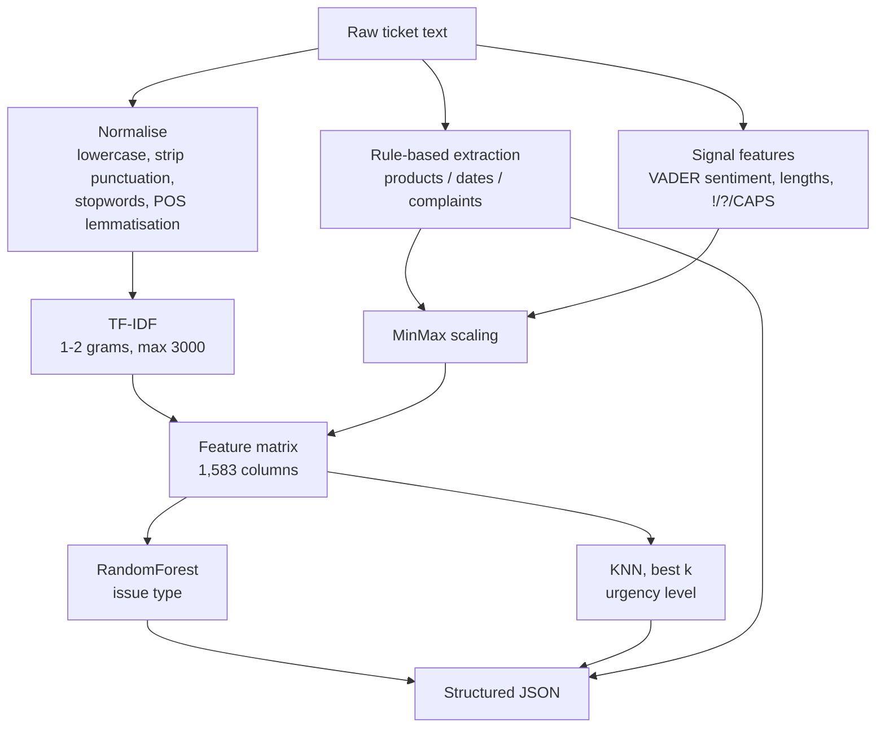

<h1 align="center">Customer Support Ticket Classifier</h1>

<p align="center">
  Two-target classification of free-text support tickets — issue type and urgency level —<br>
  with rule-based entity extraction and a Gradio interface for live testing.
</p>

<p align="center">
  
  
  
  
  
  
  
  <br>
  <a href="https://vishnujan-narayanan.vercel.app/"></a>
  <a href="https://github.com/VishnujanNarayanan"></a>
  <a href="https://www.linkedin.com/in/vishnujan-narayanan"></a>
  <a href="https://substack.com/@vishnujannarayanan"></a>
</p>

<p align="center">
  🎯 <a href="#why-this-project-exists">Why</a> ·
  🧩 <a href="#architecture">Architecture</a> ·
  📊 <a href="#results">Results</a> ·
  ⚡ <a href="#installation">Installation</a> ·
  🧑‍💻 <a href="#usage">Usage</a> ·
  ⚠️ <a href="#limitations">Limitations</a> ·
  🗺️ <a href="#roadmap">Roadmap</a>
</p>

---

## Why this project exists

Support desks receive tickets as unstructured prose. Routing them requires two decisions that
are normally made by hand: *what kind of problem is this* and *how fast does it need attention*.

This project trains both decisions as separate supervised models over the same feature matrix,
and pairs them with a rule-based extractor that pulls the concrete details a human agent would
scan for — the product mentioned, the date of the incident, and the complaint language used.

The result is a single `predict_ticket(text)` call that turns one string into a structured record.

## Features

- Text normalisation with POS-aware lemmatisation (NLTK `WordNetLemmatizer` + `pos_tag`).
- Rule-based entity extraction: products, dates, and complaint keywords.
- Handcrafted signal features: VADER sentiment, ticket length, character length, exclamation
  and question counts, and all-caps word counts.
- TF-IDF over unigrams and bigrams, capped at 3,000 features.
- Two independent classifiers: `RandomForestClassifier` for issue type, `KNeighborsClassifier`
  for urgency with a sweep over `k ∈ {3, 5, 7, 10, 15}`.
- A Gradio interface exposing issue type, urgency, and extracted entities as three outputs.

## Architecture

Both targets are predicted from one shared feature matrix. The two model heads are trained
independently — there is no shared representation learning between them.



### Feature composition

On the 629-row deduplicated dataset the matrix resolves to:

| Block | Columns |
|---|---|
| TF-IDF (1–2 grams) | 1,563 |
| Entity + signal features | 20 |
| **Total** | **1,583** |

The 20 handcrafted columns are `num_products`, `num_dates`, `num_complaints`, their three
binary `has_*` counterparts, eight per-keyword complaint flags, and `ticket_length`,
`sentiment`, `exclamation_count`, `question_count`, `all_caps_count`, `char_length`.

## Results

Evaluated on a 20% held-out split (126 tickets, `random_state=42`).

### Issue type — RandomForest

| Class | Precision | Recall | F1 | Support |
|---|---|---|---|---|
| Account Access | 1.00 | 1.00 | 1.00 | 9 |
| Billing Problem | 1.00 | 1.00 | 1.00 | 18 |
| General Inquiry | 1.00 | 1.00 | 1.00 | 16 |
| Installation Issue | 1.00 | 1.00 | 1.00 | 17 |
| Late Delivery | 1.00 | 1.00 | 1.00 | 24 |
| Product Defect | 1.00 | 1.00 | 1.00 | 21 |
| Wrong Item | 1.00 | 1.00 | 1.00 | 21 |
| **Accuracy** | | | **1.00** | **126** |

A perfect score is a finding about the dataset, not the model — see [Limitations](#limitations).

### Urgency level — KNN sweep

| k | Accuracy |
|---|---|
| 3 | 0.3254 |
| 5 | 0.3492 |
| 7 | 0.3254 |
| 10 | 0.2937 |
| **15** | **0.3571** |

Best-of-sweep accuracy is **0.357**, against a majority-class baseline of 0.381 (48 Medium of
126). Urgency is not recoverable from these features; this is reported rather than hidden.

## Project Structure

```
ticket-classifier-nlp/
├── Task1_Ticket_Classifier_Final.ipynb   # Full pipeline: prep, features, training, Gradio app
├── requirements.txt                       # Pinned dependencies
└── README.md
```

The notebook is self-contained — preprocessing, feature construction, both models, the
inference function, and the Gradio launch all live in it.

## Installation

Clone the repository:

```bash
git clone https://github.com/VishnujanNarayanan/ticket-classifier-nlp.git
cd ticket-classifier-nlp
```

Create a virtual environment:

```bash
python -m venv env
source env/bin/activate      # Linux / macOS
env\Scripts\activate         # Windows
```

Install dependencies:

```bash
pip install -r requirements.txt
```

Download the NLTK corpora used at runtime:

```python
import nltk
for pkg in ("punkt", "stopwords", "wordnet", "vader_lexicon", "averaged_perceptron_tagger"):
    nltk.download(pkg)
```

## Usage

### Notebook

```bash
jupyter notebook Task1_Ticket_Classifier_Final.ipynb
```

Run top to bottom. The final cell launches the Gradio app on a local URL
(`http://127.0.0.1:7862` in the recorded run).

### Inference

```python
result = predict_ticket(
    "My phone crashed on 25/05/2024 and it hasn't worked since. Very frustrated!"
)
```

```json
{
  "issue_type": "Product Defect",
  "urgency_level": "Medium",
  "entities": {
    "products": ["phone"],
    "dates": ["25/05/2024"],
    "complaint_keywords": []
  }
}
```

Note that `crashed` does not match the `crash` keyword — the extractor uses word-boundary
matching on unlemmatised text, which is a known gap.

### Gradio interface

The interface takes one textbox and returns three fields: issue type, urgency level, and the
extracted entity dictionary. It is launched from the notebook's last cell.

## Configuration

The pipeline has no configuration file. The values that control behaviour are literals in the
notebook:

| Setting | Value | Where |
|---|---|---|
| Input dataset | `ai_dev_assignment_tickets_complex_1000.xlsx` | Read via `pd.read_excel`, relative to the notebook |
| TF-IDF max features | 3000 | `TfidfVectorizer` |
| TF-IDF n-gram range | (1, 2) | `TfidfVectorizer` |
| Test split | 0.2 | `train_test_split` |
| Random seed | 42 | `train_test_split`, `RandomForestClassifier` |
| KNN sweep | 3, 5, 7, 10, 15 | Urgency training loop |
| Product vocabulary | laptop, phone, charger, headphones, battery | `product_list` |
| Complaint vocabulary | broken, late, error, issue, crash, not working, damaged, fail | `complaint_keywords` |

## Example Workflow

1. Place the ticket spreadsheet alongside the notebook, named
   `ai_dev_assignment_tickets_complex_1000.xlsx`.
2. Run the preprocessing cells — rows missing `ticket_text`, `issue_type`, or `urgency_level`
   are dropped, then duplicate ticket bodies are removed, leaving 629 rows.
3. Run the feature cells to build the 1,583-column matrix.
4. Run the training cell. The issue-type report prints immediately; the urgency loop prints one
   report per `k` and keeps the best model in `best_model`.
5. Run the inference cell to check a single ticket.
6. Run the final cell to launch Gradio and test interactively.

## Dependencies

| Package | Why |
|---|---|
| `scikit-learn` | TF-IDF vectorisation, both classifiers, metrics, scaling, splitting |
| `nltk` | Tokenisation, stopwords, POS tagging, WordNet lemmatisation, VADER sentiment |
| `pandas` / `numpy` | Dataframe handling and matrix assembly |
| `openpyxl` | Reading the ticket spreadsheet export |
| `gradio` | Browser interface for live prediction |
| `matplotlib` | Plotting during exploration |

## Development

The project is a single notebook, so the workflow is:

```bash
jupyter notebook           # edit and run
ruff check .               # ruff is pinned in requirements.txt
```

## Limitations

- **Issue-type accuracy of 1.00 is not a credible generalisation estimate.** Every class scores
  perfectly on all 126 held-out tickets, which points to templated or near-duplicate ticket
  text in the source dataset rather than a genuinely solved task.
- **Urgency prediction does not work.** The best configuration reaches 0.357 accuracy, below the
  0.381 majority-class baseline. TF-IDF plus surface signals do not carry the urgency label.
- **The dataset is not in this repository.** `.gitignore` excludes spreadsheets, so the file
  must be supplied separately; the notebook expects it beside the notebook under its original
  name.
- **Entity extraction is a fixed vocabulary.** Five products and eight complaint keywords,
  matched literally. Inflected forms (`crashed`) and unlisted products are missed.
- **Nothing is persisted.** Models, the vectoriser, and the scaler live only in kernel memory;
  restarting the notebook requires retraining.
- **`predict_ticket` rebuilds its feature vector by hand**, in column order that must be kept in
  sync with training manually, and constructs a new VADER analyser on every call.

## Roadmap

- Persist the vectoriser, scaler, and models with `joblib` so inference does not require training.
- Replace the hand-built inference feature vector with a shared `sklearn` `Pipeline`.
- Investigate the issue-type leakage — inspect near-duplicate ticket bodies across the split.
- Lemmatise before complaint-keyword matching so inflected forms are caught.
- Try stronger urgency models (gradient boosting, linear SVM) and class-aware metrics before
  concluding the label is unlearnable.

## License

Released under the MIT License — free to use, modify and distribute, with attribution and
without warranty.

## Author

<p align="center">
  <strong>Vishnujan Narayanan</strong>
</p>

<p align="center">
  <a href="https://vishnujan-narayanan.vercel.app/"></a>
  <a href="https://github.com/VishnujanNarayanan"></a>
  <a href="https://www.linkedin.com/in/vishnujan-narayanan"></a>
  <a href="https://substack.com/@vishnujannarayanan"></a>
</p>
